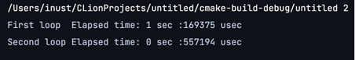
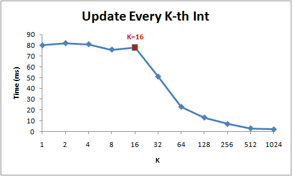
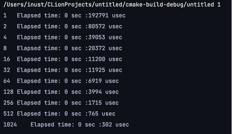
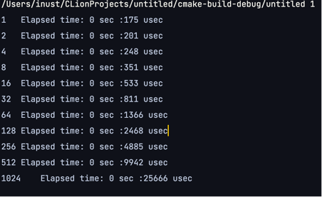

이 글은 CSAPP 5장 프로그램 최적화 챕터와 단국대학교 소프트웨어학과 최종무 교수님의 시스템 프로그래밍 수업에 나오는 내용들을 기반으로 작성되었습니다.

본 레포트에서는 캐시라인, 병렬 수행 등 여러가지 요소에 의해 프로그램의 수행시간이 어떻게 변화하는지를 파악하고 이에 대해 중점적으로 조사하고자 합니다.

우선, 함수 포인터를 선언하고 command line argument로 숫자를 입력받아 이에 따라 서로 다른 프로그램이 실행되게 하였습니다. 헤더파일에는 시간측정 함수 gettimeofday를 통해 나온 시간 차이를 출력해주기 위한 TimeGap이라는 함수를 선언하고 이를 사용하였습니다. 측정을 위해 사용한 프로그램으로는
1.	명령어의 의존도에 따라 병렬수행으로 프로그램 수행시간이 얼마나 최적화되는지를 측정한 void parelle()
2.	Int 배열을 탐색하는 루프를 돌며, 캐시라인의 크기를 확인하고 cpu 캐시 / 캐시라인이 프로그램 성능에 미치는 영향을 측정한 void cacheline()
3.	Cacheline()에서 루프의 반복횟수가 수행시간에 주는 영향을 고립시켜 캐시의 fetch 시간의 영향을 더 큰 비중을 두어 측정한 void cacheline2()
4.	멀티 쓰레드 환경에서 복수의 태스크가 동일한 캐시라인에 쓰기 연산을 행할 시 일어나는 메모리 거짓공유현상과 이에 따른 성능저하를 측정한 void falsesharing()
      이 있습니다.


우선 parallel부터 알아보겠습니다.
```
void parellel(){
int a[2]={0,0};
int b[2]={0,0};
Time stime, etime;
gettimeofday(&stime, NULL);
for(int i=0;i<1024*1024*256;i++)
{
a[0]++;
a[0]++;
}
gettimeofday(&etime, NULL);
printgap(stime, etime);
gettimeofday(&stime, NULL);
for(int i=0;i<1024*1024*256;i++)
{
b[0]++;
b[1]++;
}
gettimeofday(&etime, NULL);
printgap(stime, etime);

}
```
parellel에서는 2개의 배열을 선언하고, 2개의 루프문에서, 1개는 배열 1개의 동일한 인덱스에 대해 2번의 덧셈 연산을, 나머지는 서로 다른 배열 인덱스 대해 병렬적으로 덧셈 연산을 수행하였습니다. 언뜻 생각하기에는 두 루프의 수행시간에 차이가 없어야할 것만 같지만, 실제로는 어떨까요?



결과는 다음과 같습니다. 첫번째 루프의 수행시간이 두번째 루프보다 2배 이상으로 큰 것을 볼 수 있습니다. 그 이유는 왜일까요? 바로 첫번째 루프의 2번의 덧셈연산 간에 서로 의존성이 있기 때문입니다, 첫번째 루프에서는 하나의 루프에서 동일한 인덱스를 2번 증가시키고 있고, 이에 따라 뒤에 오는 덧셈연산을 수행하기 위해서는 앞에서의 덧셈연산의 결과가 수행되어야 합니다.
제가 사용하고 있는 시스템 환경은 애플 실리콘 M1 환경으로, ARM CPU를 사용합니다. 정확히 인텔 CPU와 동일하지는 않지만, 기본적으로 functional unit들은 서로 병렬적으로 수행될 수 있으며, 이를 superscalar라고 부릅니다. 2번째 루프에서는, 배열의 서로 다른 인덱스에 대해서 독립적으로 연산을 수행할 수 있기 때문에, 2번의 연산이 2개의 ALU에서 독립적으로(병렬로) 수행됩니다 하지만 첫번째 루프에서는 데이터 의존성이 있습니다. A[0]에 해당하는 인덱스의 값을 한번 증가시키고, 그 후 다시 값을 한번 더 증가시키려면, 첫번째 덧셈 연산의 결과가 수행되어(exe) 쓰여진 상태여야 합니다(res). 따라서 첫번째 루프는 functional unit을 병렬적으로 사용할 수 없으며, 이에 따라 2번째 루프와 2배가 넘는 시간차이가 나게 됩니다.

	다음은 void cacheline()입니다.

```

void cacheline() {

int* arr = (int*)malloc(sizeof(int) * (1024*1024*64));
//아래 두줄은 시간측정용 변수
Time stime , etime;
//k*2 씩하며 증가
for (int k = 1; k <= 1024; k *= 2) {
printf("%d", k);
gettimeofday(&stime, NULL);
for (int i = 0; i < 1024*1024*64; i += k) {
arr[i] *= 3; //인덱싱
}
gettimeofday(&etime, NULL);

        printgap(stime,etime);

    }
}
```

이 함수 에서는,  int 타입의 일차원 배열을 동적으로 선언한 뒤, 루프를 도는 주기 k를 2배씩 증가시키면서 inner loop에서 곱셈 연산을 수행하고 이 시간을 각각 측정하고 있습니다. 시작 전에 결과를 예측해 보자면, 루프를 도는 간격이 가장 긴 경우부터(k=1) 가장 짧은 경우까지(k=1024) 프로그램 수행시간이 배수로 일정하게 감소하는 법칙을 보일 것 같습니다. 실제로 그런지 확인해보기 전에, 우선 일반적인 인텔 CPU에서의 수행결과를 알아보겠습니다.
일반적으로 인텔 CPU에서는, CPU가 메모리에서 직접 데이터를 1바이트씩 꺼내는 것이 아니라, 캐시라인(캐시의 크기)인 64바이트 만큼 메모리에서 데이터를 적재한 뒤 캐쉬에서 필요한 데이터를 가져오게 됩니다. 따라서 인텔 CPU에서는, 캐시에 데이터를 fetch하는 속도가 CPU의 연산 수행시간에 비해 상대적으로 더 크기 때문에, 데이터의 크기가 캐시라인의 크기 이상으로 증가하는 k=16 구간에서 다음과 같은 양상을 띠게 될 것이라고 예측됩니다.
 




출처: http://igoro.com/archive/gallery-of-processor-cache-effects/


즉, 이는 전체 프로그램의 수행시간에서 캐시에 데이터를 fetch하는 속도가 cpu의 연산 수행시간에 비해 상대적으로 더 클 경우에 예측되는 추이입니다. 루프의 사이즈가 cacheline보다 커지게 되는 k=16지점 부터 캐시에 데이터를 fetch하는 횟수가 줄어들게 되고, 이에 따라 루프의 사이즈에 반비례하여 수행속도가 감소하는 것입니다 그러면 제 시스템에서의 결과는 어떨까요?



실제 수행 결과입니다. 시작 부분에는 루프를 도는 주기 k를 출력하도록 하였습니다. 우선 k가 1부터 16까지인 경우, 실제로 수행시간이 2배씩 줄어드는 것처럼 보입니다. 하지만 중간 지점에서 주기 k가 16에서 32로 증가하는 구간에서는, 오히려 수행시간이 증가하는 현상이 보입니다.
우선, 애플 실리콘 m1에서 캐시라인의 크기는 인텔 cpu의 2배인 128바이트 입니다. 즉, int 배열의 경우 k=32지점에서부터 캐시의 데이터 fetch횟수가 줄어들고 이에 따라 반비례하는 그래프가 나타나야 하지만, 실제로는 전구간에 걸쳐 균일하게 반비례하는 모습을 보입니다.
정확한 이유는 알 수 없지만, 애플 실리콘에서는 캐시라인의 크기와 상관없이 캐시에 데이터를 fetch하는 횟수가 동일하거나, 혹은 캐시가 데이터를 fetch하는 속도 자체가 cpu의 연산 수행 속도보다 크지 않을 수 있습니다. 따라서 전체 루프문의 수행시간 또한 캐시의 데이터 fetch 횟수가 아닌, cpu의 연산 횟수가 결정하는 것이죠. 이 부분에 대해서는 m1 칩이 시장에 나온지 얼마 되지 않아 마땅한 자료가 없어 확인하지 못하였지만, SoC인 m1 칩의 특성상 이러한 설명이 합당하지 않을까라고 추측해 보는 바입니다.
그렇다면 반복문의 반복 횟수를 서로 동일하게 한 뒤에 건너뛰는 인덱스의 크기를 점점 증가시켜서, 최대한 캐쉬의 데이터 fetch가 수행시간에 미치는 영향을 독립적으로 구해보면 어떨까요?
코드는 다음과 같습니다.
```
for (int k = 1; k <= 1024; k *= 2) {
int *ptr = (int*)malloc(sizeof(int)* (k*1024*64));

    printf("%d\t", k);
    gettimeofday(&stime, NULL);
    for (int i = 0; i < k*1024*64; i += k) {
        ptr[i] *= 3; //인덱싱
    }
    gettimeofday(&etime, NULL);

printgap(stime, etime);

}
```
앞선 코드와 다른 점은, 루프 외부에서 동적할당 했던 배열은, 이번에는 인덱스를 건너뛰는 크기 k에 비례하여 커지게 만들어, 반복문의 횟수를 전부 동일하게 했다는 것 뿐입니다.
결과는 어떨까요?




완벽하게 인텔 cpu 처럼 캐시라인 크기 보다 작을 경우 수행시간이 비슷하지는 않지만, 어느정도 캐시라인 임계점인 k=32 이전에서 증가폭이 더뎌진 것을 볼 수 있습니다. 즉 데이터를 fetch하는 횟수가 같아지면서, 실제 수행시간의 증가폭도 감소한다는 것을 볼 수 있는 것이죠. 마찬가지로 캐시라인 크기 임계점인 k=32를 넘어가면, 증가폭이 2배 이상으로 뛰는 것도 볼 수 있습니다. 데이터 fetch 횟수가 줄어들기 때문입니다. 즉, 완벽히 인텔 cpu처럼 프로그램의 수행시간의 결정요소가 데이터 fetch 횟수에 반비례하는 양상을 보이진 않더라도, 여전히 캐시의 데이터 횟수가 프로그램 수행시간에 있어서 다른 요소보다 더 큰 영향을 끼친다는 것을 알 수 있습니다.


다음은 메모리 거짓공유를 실험하기 위한 프로그램인 void cacheline2()입니다.

```
int arr1[100];
int arr2[100];

void cacheline2() {
Time stime, etime;
gettimeofday(&stime, NULL);
pthread_t t1;
pthread_t t2;
pthread_create(&t1, NULL, function1,  NULL);
pthread_create(&t2, NULL, function2, NULL);
pthread_join(t1, NULL);
pthread_join(t2, NULL);
gettimeofday(&etime, NULL);
printgap(stime, etime);

    gettimeofday(&stime, NULL);
    function1(NULL);
    function2(NULL);
    gettimeofday(&etime, NULL);
    printgap(stime, etime);
}

void* function1(void * arg) {
for (size_t i = 0; i < 0xfffffff; i++)
arr1[99] = 10;
}

void* function2(void * arg) {
for (size_t i = 0; i < 0xfffffff; i++)
arr2[0] = 99;
}
```

arr1과 arr2를 전역으로 연이어 선언하였네요. Arr1과 arr2는 인접한 공간에 위치하게 되기 때문에, 캐시라인의 크기를 64바이트로 가정했을 때 function	1과 function에서 사용하는 arr1[99]와 arr2[0]는 다른 배열이지만 캐시라인에 같이 올라가게 됩니다. 그런데 두 쓰레드에서 같은 캐시라인에 있는 데이터를 참조하고 있네요. Pthread API를 사용하여 두개의 쓰레드로 각각의 함수를 실행한 결과와 싱글 쓰레드에서 순차적으로 실행한 결과에 대해서 모두 수행시간을 측정해보았습니다. 과연 결과는 어떨까요?

우선 인텔 CPU에서, 복수의 동시실행 태스크가 이렇게 동일한 캐시라인에 배치된 데이터을 새롭게 쓰게 된다면 거짓 공유가 발생합니다. 하나의 태스크가 어떤 변수에 쓰기 동작을 시행하면 양쪽 태스크에 캐시라인이 같이 무효화되버리는 현상을 말합니다. 이렇게 캐시라인이 무효화될 때마다 재로딩되므로, 수행시간이 증가할 가능성이 높아집니다. 이를 해결하려면 저희가 수업시간에 배운 __attribute__ 예약어로 메모리 정렬을 사용해 서로 다른 캐시라인에 배치해야 합니다.
그럼 과연 예상과 마찬가지로 거짓공유가 일어나 성능이 저하될지, 싱글 쓰레드와 성능차이가 어떤지 확인해보겠습니다.


이런, 전혀 반대의 결과를 내고 말았네요. 멀티 쓰레드가 메모리 거짓 공유 현상 없이 캐시라인을 그대로 잘 활용하여 수행시간이 단축된 결과가 나왔습니다. 사실 m1칩은 그 작동 기전에 대한 부분이 자료가 많이 없어 명확히 어떤 방법으로 캐시가 동작하는지 확인하기 어려운 부분이 있습니다. 하지만 우선 m1 칩에서는 L1/ L2 캐시 모드 캐시의 크기가 모두 인텔 cpu에 비해 증가하였습니다. 명령어/데이터가 각각 32kb였던 인텔 CPU에 비해 M1 칩은 각각 192kb/128kb의 크기를 가집니다(명령어/데이터 순서) 이러한 비교적 큰 캐시사이즈로 인해 쓰레드가 독립적인 캐시라인을 가질 가능성(메모리 정렬을 통해)을 생각해볼 수 있습니다.

결론은 다음과 같습니다. 첫번 째 프로그램인 void parallel()에서는 데이터 의존성이 존재하는 2개의 연산이 있는 루프와, 데이터 의존성이 없는 2개의 연산이 있는 루프에 대한 수행시간을 각각 측정했습니다. 결과는 데이터 의존성이 존재하는 경우 명령어의 superscalar 시행이 불가능하다는 것과, 이에 따라 수행시간이 훨씬 길어진 다는 것이었습니다.
두번 째로는, void cacheline()에서 캐시라인의 크기보다 작은 4바이트 부터(int배열) 캐시라인의 크기인 128바이트보다 훨씬 큰 크기까지 루프를 건너뛰는 크기를 변경해가면서 속도를 측정하였습니다. 결과는 인텔 cpu에서 예상됐던 것과는 달리, m1 환경에서는 캐시라인 크기보다 작은 경우에도 실제 연산횟수와 반비례하여 수행시간이 감소하였고, 이에 따라 m1에서 캐시에 데이터를 fetch하는 횟수가 캐시라인과 상관없이 동일하거나, 혹은 캐시에 데이터를 fetch하는 속도 자체가 cpu 연산속도와 비교했을 때 별로 차이가 없을 수 있다는 추측을 해보았습니다.
마지막으로는, void cacheline2()라는 프로그램의 수행시간 측정을 통해 동일한 캐시라인에 올라간 데이터가 복수의 태스크에서 접근될 때 일어나는 메모리 거짓공유 현상과, 그에 따른 캐시라인 무효화 및 성능의 저하를 알아보고자 했습니다. 캐시라인 무효화란 복수의 태스크가 공유하고 있는 동일한 캐시라인에 대해 쓰기 연산이 발생했을 시, 캐시 데이터를 다시 fetch하는 현상을 말합니다. 저의 m1 시스템 환경에서는 캐시라인이 128바이트로 인텔 cpu에 2배로 더 큽니다. 캐시라인이 더 큰 경우, 보통 메모리 거짓공유의 위험성이 더 크다고 평가합니다. 하지만 실제 실험결과,  캐시 거짓공유 현상이 2개의 쓰레드로 작업 수행 시에 일어나지 않았고, 이에 따라 서로 다른 쓰레드는 서로 독립적인 캐시라인을 사용하거나, 혹은 자체적으로 캐시에서 메모리를 정렬하여 2개의 캐시라인을 쓸 가능성에 대해 추측해보았습니다.
